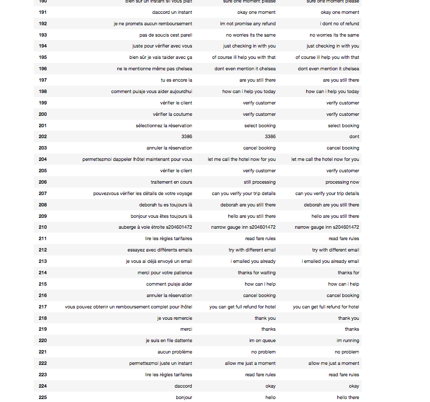

# Machine-Language-Translation-Using-RNN

### MODEL
``` Used a sequence to sequence RNN Encoder Decoder model with Bidirectional LSTMS```

### DATASET
``` Training happened over 50-60K English French sentence pairs```

### Results:

